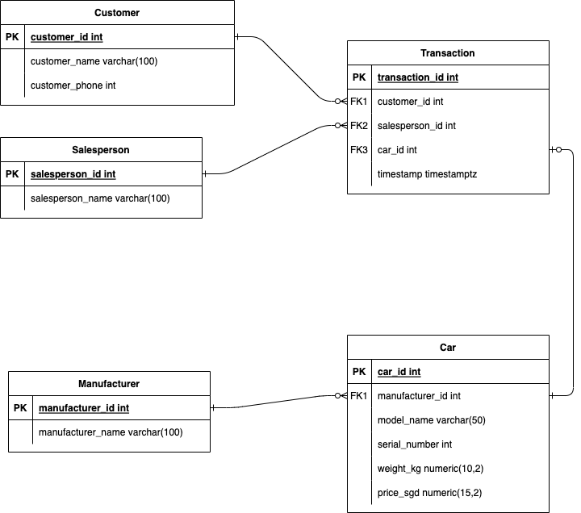

# Task 2 - Databases

Create database design for car dealership.

The solution includes:
- ER Diagram
- SQL DDL statements for materializing all the tables and their 
- SQL DML statements to pump data to the tables
- SQL DML statements to simulate user queries

## Solution Overview

The solution provided uses official Postgres Docker image from Dockerhub for its base image with minimal modification.

The SQL DDL and DML statements to bootstrap the tables are being placed in a startup directory (as indicated in the [official documentation](https://hub.docker.com/_/postgres)), and will be executed upon startup.

## ER Diagram

## SQL Queries

There are two SQL directories in this project, namely:
- `sql` which consists of DDL staments and DML statements to bootstrap all the tables
- `sql-queries` which consists of SQL DML statements to simulate user queries.

## How to run

1. Build the docker image

        make build

2. Run the docker container from the newly built image

        make run

3. Exec inside the docker container

        make exec

4. Inside the container's shell, to run the existing queries, simply invoke

        ./execute_sql_query.sh <path/to/sql_query.sql>

    for example:

        ./execute_sql_query.sh sql-queries/01-customer_spending.sql

5. Alternatively, you can go to Postgres interactive shell

        ./login.sh

    and execute interactive query from there.

## Clean up

1. Exit from the container's shell and remove the running container

        make destroy

## Future Improvements

If you notice, the solution uses the default `postgres` user, default `postgres` database, and without strong authentication and authorization strategy, which is not suitable for production grade deployment. Furthermore, no resource tuning has been made as well to accomodate real-world traffic. Also the current mode of deployment is a single-node architecture, which the node itself becomes a single point of failure without any high availability properties.

However, for the sake of this exercise, which main focus is to demonstrate data modelling, all the infrastructure shortcomings above will be left for future improvement.
