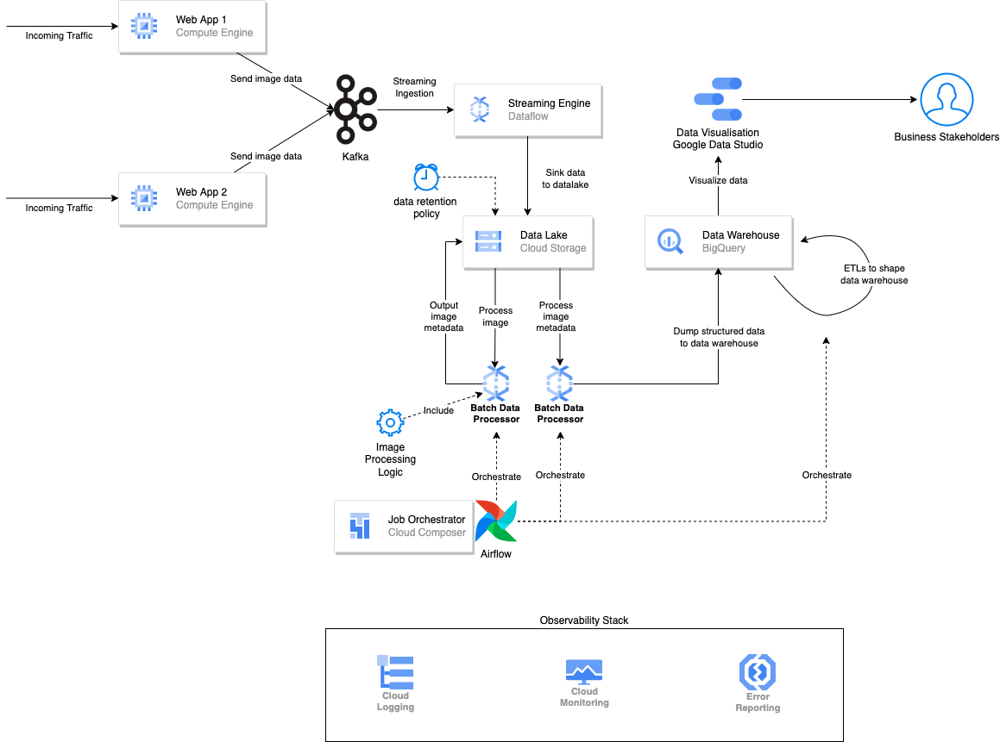

# Task 3 - System Design

Designing a data architecture solution for a company whose main business is in processing images

The solution includes:
- Data Architecture diagram
- Short presentation slides to explain about the proposed data architecture based on client requirements

## Architecture Diagram

## Solution Overview

The solution provided use Google Cloud Platform as cloud service provider and leverage many of its managed services. The advantage of using managed service is that some, if not all, of the infrastructure and maintenance works got offloaded to cloud service provider by leveraging their infrastructure, hence the team can focus on things that matter to business and deliver result fast with a relatively lean team.

More details on the slide provided.

## Future Improvements

The current solution provided focus on getting things done fast without changing any existing implementations. Some improvements that can be made:
- Rehost the web applications from GCE VM to Kubernetes (GKE), to leverage highly scalable and high availabily of Kubernetes. 
- Kafka can also be replaced with Pub/Sub, GCP managed asynchronous message broker, so that we can offload the maintenance and operations for the infrastructure even further.

Of course the possibility are endless. However, the improvements are not without drawbacks as well. For example, by moving to Kubernetes, there is a specific level of skillset in order to navigate Kubernetes properly, hence might be more difficult to find the right team member. Also going from Kafka to Pub/Sub, even though some infrastructure works got offloaded, there might be initial migration effort, and the cost might even be bigger at a certain scale.

Therefore, the improvements here are more of tradeoffs, i.e. what you are willing to sacrifice to gain something else.
