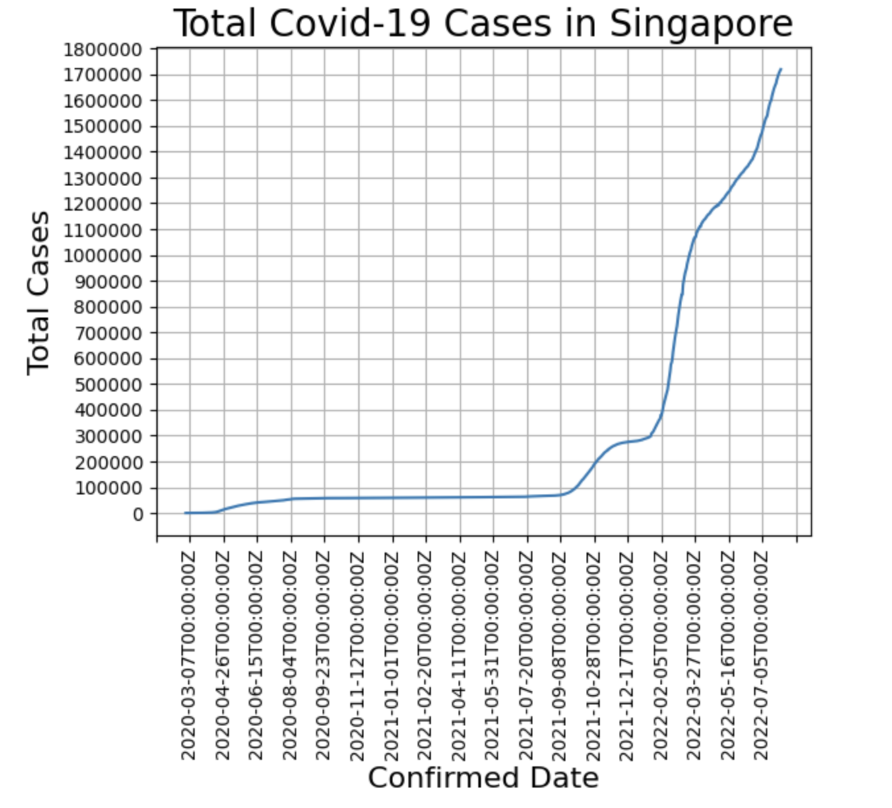

# Task 4 - Charts and APIs

Visualisation for Covid-19 Cases in Singapore over time.

The solution includes:
- An image of the total number of confirmed Covid-19 cases over time in Singapore.
- A Python Jupyter Notebook used to explore data and generate the chart.

## Solution Overview

Data is fetched from the [API](https://documenter.getpostman.com/view/10808728/SzS8rjbc#b07f97ba-24f4-4ebe-ad71-97fa35f3b683) from `2020-03-01` to `2022-08-01`.

The chart is then visualised using `matplotlib` python package via Jupyter Notebook. 

## Charts

The following chart is the total number of confirmed Covid-19 cases over time in Singapore.

## How to run

1. Install the required packages

        pip install -r requirements.txt

2. Start the Jupyter server

        jupyter notebook

    Your browser will then open a new tab, navigating to `http://localhost:8888/tree`. If your browser does not automatically open the URL, please open it manually in your browser.

3. Go to the last cell where you can see the generated chart by `matplotlib` package. If no chart appear, execute all the commands one by one from top to bottom by pressing `Shift + Enter` on each cell in orderly manner.

